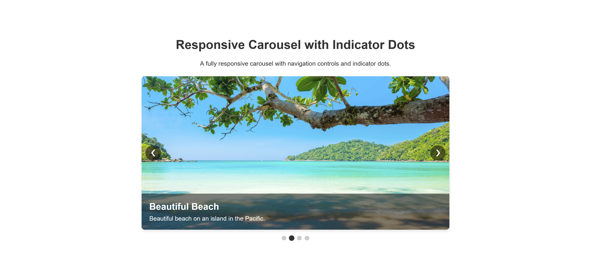

# **🎠 Responsive Carousel**

## **📜 Description**

This is a fully functional, responsive image carousel built using HTML, CSS, and JavaScript. The carousel allows users to navigate through multiple images and provides an accessible experience with ARIA (Accessible Rich Internet Applications) attributes.

The carousel supports navigation through previous and next buttons, as well as clickable indicators, to switch between slides.

## **✨ Features**

- **🌐 Responsive Design**: Adapts to all screen sizes from mobile to desktop.
- **♿ Accessible**: Uses ARIA roles and attributes for improved accessibility.
- **⏪ Navigation Controls**: Includes "previous" and "next" buttons for manual navigation.
- **🔘 Slide Indicators**: Navigation dots that show the current slide and allow direct navigation to specific slides.

## **🚀 Getting Started**

To get started with this project, follow these simple steps:

### **Installation** 📦

1. **Clone this repository:**

   ```bash
   git clone https://github.com/hermanconnor/js-carousel.git
   ```

2. **Navigate to the project folder:**

   ```bash
   cd js-carousel
   ```

3. **Open the `index.html` file in your web browser:**

   ```bash
   open index.html
   ```

   Or simply double-click the `index.html` file to view it in your browser.

## **💻 Demo**

You can view a live demo of the carousel by opening the `index.html` file in your browser.

## **🎨 Customization**

To customize the carousel for your needs, you can:

- **📸 Change Images**: Replace the images in the `/images` folder with your own images.
- **✏️ Adjust Slide Descriptions**: Edit the `<figcaption>` content in the HTML for each slide.
- **🎨 Modify Styles**: Change the appearance of the carousel by modifying the `styles.css` file.
- **➕ Add More Slides**: Duplicate any `<figure class="carousel-slide">` and update the image source and description to add more slides.

## Example

Here is a preview of the carousel:


